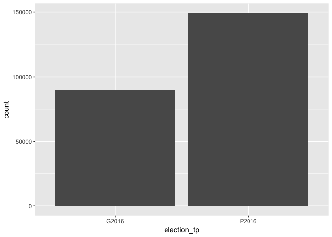
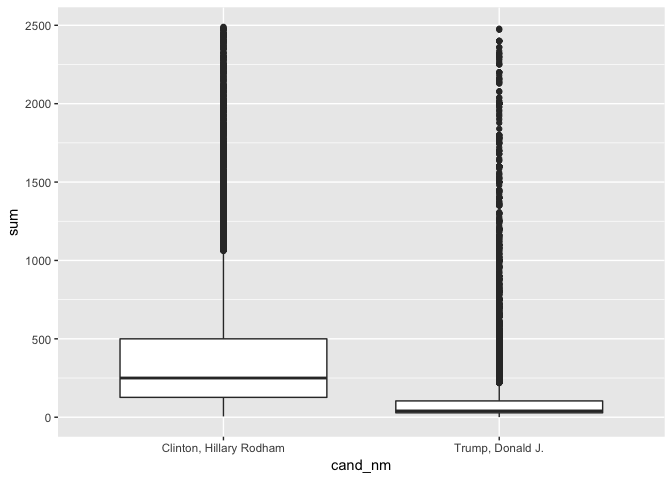

# Investigating 2016 PA Presidential Election Contributions
April 13, 2017  


# Importing the Data

I examined the 2016 Presidential Campaign Finance contributor report for the state of Pennsylvania, as provided by the Federal Election Commission (FEC). It can be found [here](http://fec.gov/disclosurep/PDownload.do). 

I wanted to investigate Pennsylvania data because it is my home state and a key swing state.


Note: I used row.names = NULL because it was reading in `cmte_id` as the row but it creates an error because of the duplicates. I thought `tran_id` could serve as the row but this too has a few duplicates.


## Viewing the Initial Dataset

After loading the data, I want to take a first look with str, summary, and View functions.


```
## 'data.frame':	243796 obs. of  18 variables:
##  $ cmte_id          : chr  "C00580100" "C00577130" "C00577130" "C00577130" ...
##  $ cand_id          : Factor w/ 24 levels "P00003392","P20002671",..: 23 12 12 12 1 12 23 23 1 1 ...
##  $ cand_nm          : Factor w/ 24 levels "Bush, Jeb","Carson, Benjamin S.",..: 22 19 19 19 4 19 22 22 4 4 ...
##  $ contbr_nm        : Factor w/ 56881 levels " HOLMES, DONNA ANCYPA",..: 43133 29444 29444 29444 27659 26292 39067 39073 50701 4559 ...
##  $ contbr_city      : Factor w/ 2090 levels "","17573-0318",..: 23 418 418 418 1435 1435 423 1574 1435 1253 ...
##  $ contbr_st        : Factor w/ 1 level "PA": 1 1 1 1 1 1 1 1 1 1 ...
##  $ contbr_zip       : int  18103 193352266 193352266 193352266 191064153 191252423 19025 19320 191232506 150651112 ...
##  $ contbr_employer  : Factor w/ 17138 levels ""," JOHN L. SPIEGELMAN TYPE & TEXT",..: 7303 10590 10590 10590 10147 6022 7303 7303 10147 7303 ...
##  $ contbr_occupation: Factor w/ 8496 levels ""," CERTIFIED REGISTERED NURSE ANESTHETIS",..: 3704 4884 4884 4884 6493 7756 3704 3704 6493 3704 ...
##  $ contb_receipt_amt: num  75.3 15 10 10 21.6 ...
##  $ contb_receipt_dt : Factor w/ 682 levels "01-APR-15","01-APR-16",..: 149 78 100 122 110 100 213 531 175 557 ...
##  $ receipt_desc     : Factor w/ 30 levels "","* EARMARKED CONTRIBUTION: SEE BELOW REATTRIBUTION/REFUND PENDING",..: 1 1 1 1 1 1 1 1 1 1 ...
##  $ memo_cd          : Factor w/ 2 levels "","X": 2 1 1 1 2 1 2 2 2 2 ...
##  $ memo_text        : Factor w/ 123 levels "","*","* EARMARKED CONTRIBUTION: SEE BELOW",..: 1 3 3 3 12 3 1 1 12 12 ...
##  $ form_tp          : Factor w/ 3 levels "SA17A","SA18",..: 2 1 1 1 2 1 2 2 2 2 ...
##  $ file_num         : int  1146165 1077404 1077404 1077404 1091718 1077404 1146165 1146165 1091718 1091718 ...
##  $ tran_id          : Factor w/ 243247 levels "A00232E849A8547D58D4",..: 160675 204212 204473 205165 83141 204265 157368 182949 83255 83804 ...
##  $ election_tp      : Factor w/ 6 levels "","G2016","G2106",..: 2 5 5 5 5 5 2 2 5 5 ...
```


```
##    cmte_id               cand_id                            cand_nm      
##  Length:243796      P00003392:119288   Clinton, Hillary Rodham  :119288  
##  Class :character   P60007168: 59627   Sanders, Bernard         : 59627  
##  Mode  :character   P80001571: 30828   Trump, Donald J.         : 30828  
##                     P60006111: 15544   Cruz, Rafael Edward 'Ted': 15544  
##                     P60005915:  9800   Carson, Benjamin S.      :  9800  
##                     P60006723:  3094   Rubio, Marco             :  3094  
##                     (Other)  :  5615   (Other)                  :  5615  
##           contbr_nm            contbr_city     contbr_st  
##  COMELLA, JOHN :   187   PHILADELPHIA: 32880   PA:243796  
##  BETHEA, DAMON :   180   PITTSBURGH  : 21740              
##  SHOVLIN, MARIE:   150   WEST CHESTER:  3646              
##  ROSOFF, ANDREW:   142   HARRISBURG  :  3638              
##  SHORT, CHRIS  :   139   LANCASTER   :  3620              
##  LIBERTIN, MARY:   136   (Other)     :178271              
##  (Other)       :242862   NA's        :     1              
##    contbr_zip                     contbr_employer  
##  Min.   :        0   N/A                  : 34161  
##  1st Qu.:152322646   RETIRED              : 31524  
##  Median :180173915   SELF-EMPLOYED        : 16257  
##  Mean   :153092041   NONE                 : 12762  
##  3rd Qu.:190951323   INFORMATION REQUESTED: 10342  
##  Max.   :196125107   (Other)              :138488  
##  NA's   :23          NA's                 :   262  
##              contbr_occupation  contb_receipt_amt   contb_receipt_dt 
##  RETIRED              : 56142   Min.   :-93308.0   12-JUL-16:  2512  
##  NOT EMPLOYED         : 17391   1st Qu.:    15.0   31-OCT-16:  2135  
##  INFORMATION REQUESTED: 10269   Median :    27.0   29-FEB-16:  2102  
##  ATTORNEY             :  5928   Mean   :   102.8   06-JUL-16:  2039  
##  PROFESSOR            :  5822   3rd Qu.:    80.0   31-MAR-16:  2004  
##  (Other)              :148175   Max.   : 10800.0   06-NOV-16:  1957  
##  NA's                 :    69                      (Other)  :231047  
##                      receipt_desc    memo_cd   
##                            :241328    :193406  
##  Refund                    :  1508   X: 50390  
##  REDESIGNATION FROM PRIMARY:   177             
##  REDESIGNATION TO GENERAL  :   176             
##  REATTRIBUTION TO SPOUSE   :   134             
##  REATTRIBUTION FROM SPOUSE :   130             
##  (Other)                   :   343             
##                                memo_text       form_tp      
##                                     :160839   SA17A:193065  
##  * EARMARKED CONTRIBUTION: SEE BELOW: 57902   SA18 : 49223  
##  * HILLARY VICTORY FUND             : 23233   SB28A:  1508  
##  *BEST EFFORTS UPDATE               :   335                 
##  EARMARKED FROM MAKE DC LISTEN      :   281                 
##  REDESIGNATION FROM PRIMARY         :   177                 
##  (Other)                            :  1029                 
##     file_num            tran_id       election_tp   
##  Min.   :1003942   C1014901 :     2        :   452  
##  1st Qu.:1077916   C10164585:     2   G2016: 92431  
##  Median :1104813   C10165181:     2   G2106:     1  
##  Mean   :1103468   C10179391:     2   O2016:    43  
##  3rd Qu.:1133832   C1022774 :     2   P2016:150868  
##  Max.   :1146285   C1022815 :     2   P2020:     1  
##                    (Other)  :243784
```

## Initial thoughts on the variables:

* I see that `cand_id` and `cand_nm` are both factors with 24 levels. That makes me think it is likely no errors are there.

* 56881 `contb_nm` out of 243796 observations. That means a lot of repeat donors.

* `contbr_st` is all PA as it should be.

* `contbr_zip` has a mix of 5 digit and 9 digit zip codes. A min value of 0 is a flag for at least some errors.

* `contb_receipt_amt`: many negative values surprisingly

* `contb_receipt_dt`: need to convert to date format

* `tran_id`: not entirely unique as I would expect so not an index

* `election_tp`: already see a likely error 'G2106'; shouldn't have 6 levels

* I can probably drop the following variables: `cmte_id`, `cand_id`, `contbr_city`, `contbr_st`, `contbr_employer`, `contbr_occupation`, `form_tp`, `file_num`, `tran_id`

* Interestingly, missing any party affiliation data. It should be created.

* `contb_receipt_amt` is the only legitimate numeric variable. This means I won't be able to do analysis that requires at least two numeric variables, such as correlation.

# Data Wrangling

## Investigating election_tp

I decided to first take care of a few small problems in election type on seeing levels of "O2016", "P2020", and "G2016".


```
## [1] G2016 P2016       P2020 O2016 G2106
## Levels:  G2016 G2106 O2016 P2016 P2020
```

```
##         freq
##          452
## G2016  92431
## G2106      1
## O2016     43
## P2016 150868
## P2020      1
```

* G2106 and P2020 must be simple errors. 

* 'O2016' is 'Other 2016'. All of these donations seem to be for Jill Stein's recount effort after the November General election. We should exclude this data because I'm interested in how fundraising impacted the outcome of the election.

* Not clear why 452 are blank at the moment. No obvious pattern. Maybe just didn't specify when making the donation.


After data wrangling I can see that "O2016", "P2020", and "G2016" have been removed. I will leave the 452 blank alone for now. Most seem to go to R's.


```
##         freq
##          452
## G2016  92432
## P2016 150869
```


## Investigating contb_receipt_amt

I started investigating `contb_receipt_amt` by plotting it against date. I was surprised to see one extremely negative value but also a very large number of negative values.

<!-- -->


```
##          cmte_id   cand_id          cand_nm    contbr_nm  contbr_city
## 177225 C00577130 P60007168 Sanders, Bernard CARANGI, JOE PHILADELPHIA
##        contbr_st contbr_zip contbr_employer contbr_occupation
## 177225        PA  191544036                                  
##        contb_receipt_amt contb_receipt_dt receipt_desc memo_cd memo_text
## 177225            -93308        01-MAY-16       Refund                  
##        form_tp file_num     tran_id election_tp
## 177225   SB28A  1094141 VPE83A1PJ76       P2016
```

The minimum contribution was a stunning -$93,308, which doesn't make much sense. I note though it is marked as 'Refund'.


```
##       freq     relfreq
## FALSE "240985" "0.989"
## TRUE  "2768"   "0.011"
```

There are 2,768 non-positive contributions. As a percentage of the total observations, this is very small, but it's still important to look at. 


Looking at a subset of negative donations, we can see that many are marked as refunds, some are reattributed to others, others have no explanation.

How to handle non-positive values? I thought of trying to match up negative refunds with positive donations. Because if someone donated money, and then was refunded, should that donation not be counted at all?

This wouldn't be easy though because there's no guarantee of positive and negative donations matching up. Perhaps more problematic is that some names don't exactly match up, e.g. 'FOLINO, J.A.' was refunded 8100 but there is a donation from 'FOLINO, J. A.' and 'FOLINO, JOHN' (all from same zip code) for 10800 and 2700, respectively. 


For the sake of simplicity, I decided to remove all non-positive donations from consideration. I'd be glad to know how other people handled this problem.


I should also look at outlier values for this variable but will first look at other variables.

## Investigating contb_receipt_dt

Next I want to investigate the date of contributions. First I need to convert them from factors to Date format.


```r
# contributions after election date (2016-11-08)
late <- subset(pcf2, pcf2$contb_receipt_dt > '2016-11-08')
```

I want to exclude the 1314 positive contributions (mostly for Trump) that came in after the date of the election because I am interested in contributions that influenced the outcome of the election.


```r
# updated dataframe with only positive contributions on/before election date
pcf3 <- subset(pcf2, pcf2$contb_receipt_dt <= '2016-11-08')
```

## Investigating cand_nm

Next I took a look at candidates to ensure there is no duplication or other errors.


```
##  [1] Trump, Donald J.          Sanders, Bernard         
##  [3] Clinton, Hillary Rodham   O'Malley, Martin Joseph  
##  [5] Cruz, Rafael Edward 'Ted' Walker, Scott            
##  [7] Bush, Jeb                 Rubio, Marco             
##  [9] Christie, Christopher J.  Kasich, John R.          
## [11] Johnson, Gary             Webb, James Henry Jr.    
## [13] Paul, Rand                Santorum, Richard J.     
## [15] Fiorina, Carly            Jindal, Bobby            
## [17] Huckabee, Mike            Stein, Jill              
## [19] Carson, Benjamin S.       Lessig, Lawrence         
## [21] Graham, Lindsey O.        Perry, James R. (Rick)   
## [23] Pataki, George E.         McMullin, Evan           
## 24 Levels: Bush, Jeb Carson, Benjamin S. ... Webb, James Henry Jr.
```

## Investigating contbr_zip

`contbr_zip` data include some 5 digit and some 9 digit zip codes. I broke these into separate columns so, if desired, I could do analysis by zip code and add a geographic component to the analysis.


```r
# split zip code into digits 1-5 and extra digits 6-9
pcf4 <- separate(pcf3, contbr_zip, c("contbr_zip5", "zip_extra"), sep = 5)
```

If you sort this list and then look at the head or the tail, you'll see errors. Quite a few are given as 99999, others a single digit, others another state. However since all states are listed as PA, I chose not to exclude them. These are probably simple errors or perhaps people who live in two states.

## Investigating receipt description

`receipt_desc`, `memo_cd`, and `memo_text` are there variables that are not particularly well explained. I get the sense perhaps not all but many of them are contributions flagged for refund. If that is the case, we should not consider them because such a contribution would not have been used. While there are a number of different descriptions, I think it is safer to exclude all such contributions from analysis.


```r
# data with only blank receipt descriptions
pcf5 <- subset(pcf4, pcf4$receipt_desc == "")
```

This action removed 622 observations. Given we removed 2,768 non-positive contributions earlier, this seems to be a conservative action.

## Investigating memo text

Scrolling through the memo text column, I can see that sometimes it notes a refund needs to be given. Often it is not for the full amount donated. For simplicity, anytime refund is mentioned, I will remove the entire observation, regardless of the amount noted. 


```r
# 59 observations still mention refund in memo_text
table(str_detect(as.character(pcf5$memo_text), "REFUND"))
```

```
## 
##  FALSE   TRUE 
## 238990     59
```


```r
# new dataframe with memo_text refunds removed
memo_refund <- str_detect(as.character(pcf5$memo_text), "REFUND")
pcf6 <- subset(pcf5, memo_refund == FALSE)
```

## Dump variables not to be used

Coming to the end of data wrangling, I want to remove columns I don't plan to analyse.


```r
# remove unneeded columns
pcf7 <- subset(pcf6, select = -c(cmte_id, cand_id,     
                                 contbr_city, contbr_st, 
                                 contbr_employer, 
                                 contbr_occupation, form_tp, 
                                 file_num, tran_id, zip_extra))
```

## Adding party affiliation

Below is a rather dirty way to add party affiliations to each candidate. I'm sure there is a cleaner way. But it worked.


```r
# add a new empty column
pcf7[ , "party"] <- ""

# assign parties
pcf7$party <- ifelse(pcf7$cand_nm == "Johnson, Gary", "I",
                     ifelse(pcf7$cand_nm == "Stein, Jill", "G",
                            ifelse(pcf7$cand_nm == "Webb, James Henry Jr.", "D",
                                  ifelse(pcf7$cand_nm == "Lessig, Lawrence", "D",
                                        ifelse(pcf7$cand_nm == "O'Malley, Martin Joseph", "D",
                                              ifelse(pcf7$cand_nm == "Sanders, Bernard", "D",
                                                     ifelse(pcf7$cand_nm == "Clinton, Hillary Rodham", "D", "R"
                                   )))))))
```


```r
# make party a factor variable
pcf7$party <- as.factor(pcf7$party)
class(pcf7$party)
```

```
## [1] "factor"
```

## Outliers

I took a last look at the highest contributions. One value in particular was more than 2x the next highest value. For that reason, and because it went to a candidate who dropped out early, I decided to exclude from consideration the $10,800 contribution to Scott Walker. It seems likely that even if the candidate received this money, at least part of it would need to be marked for a refund due to FEC rules. So I'd say it was bad data about an extreme case.

I'm suspicious of the values over \$5000, which I believe is the maximum in most cases. However no such contribution goes to Clinton or Trump, where most of my analysis is focused. For these values, perhaps party of the contribution in excess of $5000 was refunded but it is difficult to know. So I think it's ok to leave them.


```r
# remove an outlier
pcf8 <- subset(pcf7, pcf7$contb_receipt_amt != 10800)
```

## Assign blank election_tp

My last step in data wrangling will be to assign observations with empty election_tp values. This is true for 292 entries. I only care about the one marked for Trump, and so I can set all of them for "G2016" based on their date.


```
##         freq
## G2016  89850
## P2016 149139
```

## Initial questions about the data

* Describe how candidates received financial contributions over the course of the campaign.

* What can we say about the nature of contributions received by the top candidates? For example, how does a typical Clinton contribution compare to a typical Sanders contribution?

* What trends are discernible amongst party lines? How do contributions for Democratic candidates compare to those for Repubicans?

* In what way did contributions for the 2016 primary differ from the 2016 general election?

* Knowing the broad outcome of the election, what can we say about the role of financial contributions?

# Univariate Plots Section

## Investigating contb_receipt_amt

The most important (and only numeric) variable is the financial value of a contribution. 


```r
# summary of contb_receipt_amt
summary(pcf8$contb_receipt_amt)
```

```
##    Min. 1st Qu.  Median    Mean 3rd Qu.    Max. 
##    0.05   15.00   28.00  105.90   80.00 5400.00
```

We can get more details from the table below.


```
## # A tibble: 1 x 13
##        sum n_contributions n_contributors min_contb `25%_contb` med_contb
##      <dbl>           <int>          <int>     <dbl>       <dbl>     <dbl>
## 1 25310396          238989          55497      0.05          15        28
## # ... with 7 more variables: mean_contb <dbl>, `75%_contb` <dbl>,
## #   max_contb <dbl>, sd_contb <dbl>, iqr_contb <dbl>, range_contb <dbl>,
## #   mode_contb <chr>
```

From looking at the data, and seeing the mean and median, I expect the data will be heavily right skewed-- mostly small donations but large outliers. I'll make a histogram to see this.


```
## `stat_bin()` using `bins = 30`. Pick better value with `binwidth`.
```

<!-- -->

Even having removed one very extreme value, we still have a very long tail (most people contributing small amounts, but a few donating very high (e.g. $5000)). I'll start to zoom in. Because people will likely donate round amounts, I'll also set the binwidth argument to 1.


```
## Warning: Removed 3279 rows containing non-finite values (stat_bin).
```

<!-- -->

Removing any contribution above $1000 excludes 3279 contributions. This amounts to 1.3% of our dataset under consideration. We still get a very long tail. But setting binwidth equal to 1 really helps give a clearer picture of how people contributed. I'll zoom in on the smaller donations.


```
## Warning: Removed 6560 rows containing non-finite values (stat_bin).
```

<!-- -->

Setting our xlim to \$500 gave us a better picture. The most common contribution is \$25, followed by \$50, \$100, \$10. We can still see spikes or modes at \$200, \$250, and $500.

Being a bit more precise, I can remove the top 5% of contb_receipt_amt values.


```
## Warning: Removed 11696 rows containing non-finite values (stat_bin).
```

<!-- -->

I can manipulate the x scale to examine how it impacts the visualization. Putting the x axis in log 10 scale gives us something closer to a normal distribution.


```
## `stat_bin()` using `bins = 30`. Pick better value with `binwidth`.
```

<!-- -->

We can also try a boxplot of the same data.

<!-- -->

We can do the same with ggplot.

<!-- -->

The presence of outliers makes the boxplot less useful without zooming in. We'll return to it when we compare distributions of parties or candidates, which is what the boxplot is better suited for.

## Investigating contb_receipt_dt

The variable date of contribution can also gives us some idea of the course of the campaign over time.


```r
# first contribution
first_contribution <- min(pcf8$contb_receipt_dt)
first_contribution
```

```
## [1] "2014-07-17"
```


```r
# duration of campaign 
campaign_duration <- max(pcf8$contb_receipt_dt) - min(pcf8$contb_receipt_dt)
campaign_duration
```

```
## Time difference of 845 days
```


```
## `stat_bin()` using `bins = 30`. Pick better value with `binwidth`.
```

<!-- -->

We see that while the first contribution was received in July 17, 2014, the bulk of contributions do not begin until much later. We can get a better picture by beginning on 1 July 2015.


```
## `stat_bin()` using `bins = 30`. Pick better value with `binwidth`.
```

```
## Warning: Removed 2933 rows containing non-finite values (stat_bin).
```

```
## Warning: Removed 1 rows containing missing values (geom_bar).
```

<!-- -->

A density plot smoothes this out, showing 3 modes.


```
## Warning: Removed 2933 rows containing non-finite values (stat_density).
```

<!-- -->

But it is probably more complicated than that as we see with binwidth = 1.


```
## Warning: Removed 2933 rows containing non-finite values (stat_bin).
```

<!-- -->

The previous histogram and density plots had a few humps but you could mistake it for a steady increase in the frequency of donations. However, setting binwidth = 1 you see a more nuanced picture. The two most popular days for donations are much further out from the end of the campaign. Overall, more contributions were taken at the end, but it's interesting to see how much it varies day to day. 

NB: These are just counts of contributions made and not their financial value. E.g. a $1 and $100 donation are recorded similarly.

## Investigating contbr_nm

Do most people that give usually just give once? Or do they donate repeatedly? The output below doesn't tell us anything about the amounts donated, but at least a handful of people donated repeatedly.


```
##                    freq
## COMELLA, JOHN       187
## BETHEA, DAMON       180
## SHOVLIN, MARIE      150
## ROSOFF, ANDREW      142
## SHORT, CHRIS        139
## LIBERTIN, MARY      136
## WEITKAMP, RICKY     132
## EDWARDS, JOHN P     130
## LONCAR, BRANDON     130
## TECHNER, LEE        127
## HANN, STEVE E       125
## SHOFF, IAN          125
## KESSINGER, KARA     122
## MENSAH, HARRISON    121
## CERRA, ANGELO       120
## MYERS, CAROL LEE    120
## JOHNSON, MARCIA     118
## MEDNICK, ELIZABETH  118
## BOLAS, WENDY        113
## ROHE, BERNIE        110
```

The histogram though shows us this is unusual behavior. 

<!-- -->

And now zooming in...


```r
# histogram of frequency of donor contribution (zoomed in)
hist(table(pcf8$contbr_nm), 
     xlim = c(0, 50), 
     breaks = seq(0, 200, 1))
```

<!-- -->

In fact, while the median frequency contribution is 1, outliers stretch the mean to 4.20. The mode of course is also 1.


## Investigating election_tp

The dataset marks contributions designated for the primary and those for the general election.


```
##       freq     relfreq
## G2016 "89850"  "0.38" 
## P2016 "149139" "0.62"
```

In the bar chart below, it is interesting to note that more contributions were marked for the primary than the general. Perhaps this is because there are more candidates in the primary stage. The primary though, in terms of time, is much longer than the general.

<!-- -->

## Investigating party

If we want a shorter summary than looking at 24 candidates, we can look at frequency of the party variables.  


```
##   freq     relfreq
## D "177603" "0.743"
## R "60720"  "0.254"
## I "386"    "0.002"
## G "280"    "0.001"
```

Nearly 75% of number of contributions (not value) were slated for Democratic candidates, 25% for Republican, and less than 1% for Green or Independent candidates.

For my future visualizations, I'll often only be concerned about Democrats and Republicans because the totals for Greens and Independents are so small. Therefore, I subsetted this data into a new dataframe and assigned the associated colors.


You can see the disparity in the bar chart comparing Democrats and Republicans.

<!-- -->

## Investigating zipcode

I didn't heavily dig too heavily zip code data. But just looking at frequency here, even the zip code with the most contributions only amounts to 1.55% of the total. The top few are all in Philadelphia or Pittsburgh. I was surprised to see my own zip code rank 17th! 


```
##       freq   relfreq   
## 19103 "3719" "0.015561"
## 19147 "3386" "0.014168"
## 15217 "2876" "0.012034"
## 19119 "2726" "0.011406"
## 19146 "2444" "0.010226"
## 19067 "2271" "0.009503"
## 19087 "2271" "0.009503"
## 19130 "2174" "0.009097"
## 19382 "2121" "0.008875"
## 15206 "1920" "0.008034"
## 19106 "1905" "0.007971"
## 19063 "1814" "0.007590"
## 16801 "1812" "0.007582"
## 18940 "1554" "0.006502"
## 19010 "1525" "0.006381"
## 19118 "1518" "0.006352"
## 19038 "1494" "0.006251"
## 19096 "1455" "0.006088"
## 19380 "1443" "0.006038"
## 17601 "1384" "0.005791"
```

It will be more interesting to see if this changes when you consider financial contribution instead of frequency. Because zip codes are so small, it would also be better to try to geographically map the data.


```
##       freq relfreq   
## 0     "1"  "0.015561"
## 10    "1"  "0.014168"
## 10107 "1"  "0.012034"
## 10604 "1"  "0.011406"
## 10928 "1"  "0.010226"
## 11938 "1"  "0.009503"
## 15004 "1"  "0.009503"
## 15007 "1"  "0.009097"
## 15038 "1"  "0.008875"
## 15047 "1"  "0.008034"
## 15091 "1"  "0.007971"
## 15230 "1"  "0.007590"
## 15258 "1"  "0.007582"
## 15265 "1"  "0.006502"
## 15275 "1"  "0.006381"
## 15282 "1"  "0.006352"
## 15302 "1"  "0.006251"
## 15325 "1"  "0.006088"
## 15348 "1"  "0.006038"
## 15358 "1"  "0.005791"
```

Looking at the head and tails of the sorted list, in addition to showing the errors discussed in the data wrangling section, also shows that some valid PA zip codes give only 1 contribution. Seeing that 3,719 contributions came from center city Philadelphia and only 1 contribution came from a zip in Virginville is not surprising but still interesting. Of course, zip codes are not evenly distributed by population by any means.

# Univariate Analysis

**Key Summary:**
From July 7, 2014 to Nov 8, 2016, 24 candidates received a total of $25,310,396 over 238,989 valid donations from 55,497 unique contributors in the state of Pennsylvania.

* Minimum non-negative contribution: $0.05

* 25% quantile: $15

* Median contribution: $28

* Mean contribution: $105.91

* 75% quantile: $80

* Maximum contribution: $5,400

* Range: 5399.95

* IQR: 65

* Standard Deviation: 319.89


Given the heavy right skew, the median and IQR are more useful than the mean and standard deviation when describing the data.

The difference between the first campaign contribution and the date of the election is 845 days-- well over 2 years. But looking at the histogram we can see most contributions do not really start to come in until 2015 and really pick up in 2016. The greatest single window for contributions, as one might expect, was very close to the election date itself, but there is a large day to day fluctuation.

Most of the 55,497 unique contributors made their donation only once. 1 is in fact the median donation frequency. However, this data is long-tailed with a small people donating more than 100 times.

Nearly 75% of valid contributions received went to Democratic candidates; 25% went to Republicans; and a small fraction of 1 percent went to Independent or Green Party candidates.

As we can expect, it's clear that contributions vary considerably by zip code, with some urban commerce centers donating 1000s of times more than sparsely populated rural areas.

We'll have to do further bivariate and multivariate analysis however to be able to attach more meaning to this data.

### What is the structure of the dataset?

Beginning with 243,796 observations of 18 variables in the original dataset, I chose to analyse 238,989 observations of 10 variables after removing contributions after the date of the election, non-positive contributions, contributions marked for refund/reassignment etc, and unnecessary variables, adding the party variable, and removing an outlier.

### What is/are the main feature(s) of interest in the database?

The main features of interest are the contribution amount received by each candidate over the course of the campaign. We want to analyze the nature of contributions and how they might differ depending on the candidate, party, or time period in the campaign.

### What other features will help support your investigation into your feature of interest?

The key for bivariate and multivariate sections will be to group data by candidates and party. That's what is interesting about the data.

### Did you create any new variables from existing variables in the dataset?

I created a party affiliation variable because that is also an important factor one would expect that would drive donations. For example, as candidates of one party drop out, we might expect more contributions to go to candidates of the same party. It can reveal the relative strength/weakness of the party institutions in the state.

### Of the features you investigated, were there any unusual distributions? Did you perform any operations on the data to tidy, adjust, or change the form of the data? If so, why did you do this?

The data did need some cleaning. In particular I chose to remove non-positive contributions for reasons discussed above. I chose to remove contributions after the date of the election as they could not have impacted the outcome of the election. I also removed donations flagged with some kind of memo, including refunds. I separated zip code data so all had a 5 digit code. I ensured all contributions were either for the 2016 primary or 2016 general election. I removed one very extreme value because it was likely refunded at least partially.

# Bivariate Plots Section

Rather than looking at the dataset as a whole, what's more interesting is to group the data by variables such as party and candidate.

## Investigating contb_receipt_amt by party

We can group candidates by party and get a more meaningful summary than our aggregate data.

So which party raised the most money?


```
##          [,1]
## D 15615877.78
## G    25729.73
## I    93322.61
## R  9575466.07
```

Democratic candidates received \$15.6m in contributions; Republican candidates received \$9.6m; Green candidates received \$25k and Independents $93k. The bar chart shows the large fundraising advantage of Democrats over Republicans.

<!-- -->

Democratic candidates received over $6m more than the field of Republican candidates.


We can get a more detailed look at the distribution of funding per party with the summary function and our own table.


```
## pcf8$party: D
##    Min. 1st Qu.  Median    Mean 3rd Qu.    Max. 
##    0.05   14.00   25.00   87.93   50.00 5400.00 
## -------------------------------------------------------- 
## pcf8$party: G
##    Min. 1st Qu.  Median    Mean 3rd Qu.    Max. 
##    4.20   29.00   50.00   91.89  100.00 1000.00 
## -------------------------------------------------------- 
## pcf8$party: I
##    Min. 1st Qu.  Median    Mean 3rd Qu.    Max. 
##     3.0    35.0   100.0   241.8   250.0  2700.0 
## -------------------------------------------------------- 
## pcf8$party: R
##    Min. 1st Qu.  Median    Mean 3rd Qu.    Max. 
##     0.8    25.0    50.0   157.7   100.0  5400.0
```


```
## # A tibble: 4 x 20
##    party         sum       p_sum n_contributions p_contributions
##   <fctr>       <dbl>       <dbl>           <int>           <dbl>
## 1      D 15615877.78 0.616974846          177603     0.743142990
## 2      R  9575466.07 0.378321461           60720     0.254070271
## 3      I    93322.61 0.003687126             386     0.001615137
## 4      G    25729.73 0.001016568             280     0.001171602
## # ... with 15 more variables: n_contributors <int>, p_contributors <dbl>,
## #   min_contb <dbl>, `25%_contb` <dbl>, med_contb <dbl>, mean_contb <dbl>,
## #   `75%_contb` <dbl>, max_contb <dbl>, sd_contb <dbl>, iqr_contb <dbl>,
## #   range_contb <dbl>, mode_contb <chr>, rank_sum <dbl>,
## #   rank_contributors <dbl>, rank_contributions <dbl>
```

We can return to our earlier histogram but fill by party.


```
## Warning: Removed 21390 rows containing non-finite values (stat_bin).
```

```
## Warning: Removed 2 rows containing missing values (geom_bar).
```

<!-- -->

We can see that at almost every value, the value of contributions received by Democratic candidates far outweighs that received by Republicans.

<!-- -->

Although it is necessary to remove many of the outliers for both parties, this zoomed in view shows larger 25%, 50%, and 75% values for Republicans than Democrats, suggesting that Republicans tend to make larger donations.

A similar view can be achieved in a density plot.

<!-- -->

Comparing the results of the party-wise histograms and boxplot is interesting. The boxplot shows that Republicans have a higher 25%, median, and 75% quantile. In fact, the Republican 25% quantile of 25 is the Democratic median; the Republican median is the Democratic 75% quantile; the Republican 75% quantile is 2x the Democratic 75% quantile. 

Although impacted by outliers, from pcf_party, we can see that the Republican mean of \$157.70 was close to 2x the Democratic mean of $87.92.

As the histogram makes very clear, contributions to Democratic candidates, especially at values under $50, are much more numerous.


In fact, in frequency, Democrats received 116,883 more contributions than Republicans.

<!-- -->

However what is really interesting is the number of unique contributions shown in pcf_party.


<!-- -->

Despite Democrats raising a total of $6m more money than Republicans, and 116,883 more instances of a contribution, Republican candidates actually received donations from 4,393 more unique contributors.

Thus, the boxplot data showing Democratic contributions are typically smaller (lower quantiles, mean, median, etc) are undercut by the fact that many Democratic contributions are from repeat donors. 

## Investigating contb_receipt_amt by candidate

The party variable is an aggregation of individual candidates. So what we really want to examine is the candidates themselves.

We can get a short summary of each here:

```
## pcf8$cand_nm: Bush, Jeb
##    Min. 1st Qu.  Median    Mean 3rd Qu.    Max. 
##     1.0    50.0   250.0   851.2  1500.0  3700.0 
## -------------------------------------------------------- 
## pcf8$cand_nm: Carson, Benjamin S.
##    Min. 1st Qu.  Median    Mean 3rd Qu.    Max. 
##    1.00   25.00   50.00   89.39  100.00 5400.00 
## -------------------------------------------------------- 
## pcf8$cand_nm: Christie, Christopher J.
##    Min. 1st Qu.  Median    Mean 3rd Qu.    Max. 
##      15     400    1000    1378    2700    5400 
## -------------------------------------------------------- 
## pcf8$cand_nm: Clinton, Hillary Rodham
##    Min. 1st Qu.  Median    Mean 3rd Qu.    Max. 
##    0.05   15.00   25.00  109.70   89.00 5000.00 
## -------------------------------------------------------- 
## pcf8$cand_nm: Cruz, Rafael Edward 'Ted'
##    Min. 1st Qu.  Median    Mean 3rd Qu.    Max. 
##    1.00   25.00   50.00   87.39  100.00 5400.00 
## -------------------------------------------------------- 
## pcf8$cand_nm: Fiorina, Carly
##    Min. 1st Qu.  Median    Mean 3rd Qu.    Max. 
##     3.0    50.0   100.0   322.1   500.0  5000.0 
## -------------------------------------------------------- 
## pcf8$cand_nm: Graham, Lindsey O.
##    Min. 1st Qu.  Median    Mean 3rd Qu.    Max. 
##    25.0    50.0   250.0   805.6  1000.0  5400.0 
## -------------------------------------------------------- 
## pcf8$cand_nm: Huckabee, Mike
##    Min. 1st Qu.  Median    Mean 3rd Qu.    Max. 
##       1      25      50     244     100    5400 
## -------------------------------------------------------- 
## pcf8$cand_nm: Jindal, Bobby
##    Min. 1st Qu.  Median    Mean 3rd Qu.    Max. 
##   20.16   50.00  100.00  584.20  500.00 2700.00 
## -------------------------------------------------------- 
## pcf8$cand_nm: Johnson, Gary
##    Min. 1st Qu.  Median    Mean 3rd Qu.    Max. 
##     3.0    35.0   100.0   241.8   250.0  2700.0 
## -------------------------------------------------------- 
## pcf8$cand_nm: Kasich, John R.
##    Min. 1st Qu.  Median    Mean 3rd Qu.    Max. 
##    10.0   100.0   250.0   645.1  1000.0  2700.0 
## -------------------------------------------------------- 
## pcf8$cand_nm: Lessig, Lawrence
##    Min. 1st Qu.  Median    Mean 3rd Qu.    Max. 
##   11.98   87.50  100.00  306.50  250.00 2700.00 
## -------------------------------------------------------- 
## pcf8$cand_nm: McMullin, Evan
##    Min. 1st Qu.  Median    Mean 3rd Qu.    Max. 
##    5.00   25.00   50.00   76.28  100.00  250.00 
## -------------------------------------------------------- 
## pcf8$cand_nm: O'Malley, Martin Joseph
##    Min. 1st Qu.  Median    Mean 3rd Qu.    Max. 
##    15.0   250.0   500.0   897.4  1000.0  5400.0 
## -------------------------------------------------------- 
## pcf8$cand_nm: Pataki, George E.
##    Min. 1st Qu.  Median    Mean 3rd Qu.    Max. 
##   125.0   187.5   250.0   208.3   250.0   250.0 
## -------------------------------------------------------- 
## pcf8$cand_nm: Paul, Rand
##    Min. 1st Qu.  Median    Mean 3rd Qu.    Max. 
##     1.0    25.0    50.0   122.8   100.0  2700.0 
## -------------------------------------------------------- 
## pcf8$cand_nm: Perry, James R. (Rick)
##    Min. 1st Qu.  Median    Mean 3rd Qu.    Max. 
##      25     250     250     745     500    2700 
## -------------------------------------------------------- 
## pcf8$cand_nm: Rubio, Marco
##    Min. 1st Qu.  Median    Mean 3rd Qu.    Max. 
##     2.0    25.0    50.0   329.9   200.0  5400.0 
## -------------------------------------------------------- 
## pcf8$cand_nm: Sanders, Bernard
##    Min. 1st Qu.  Median    Mean 3rd Qu.    Max. 
##    1.00   10.00   27.00   42.41   50.00 5000.00 
## -------------------------------------------------------- 
## pcf8$cand_nm: Santorum, Richard J.
##    Min. 1st Qu.  Median    Mean 3rd Qu.    Max. 
##     5.0   100.0   500.0   825.2  1000.0  5400.0 
## -------------------------------------------------------- 
## pcf8$cand_nm: Stein, Jill
##    Min. 1st Qu.  Median    Mean 3rd Qu.    Max. 
##    4.20   29.00   50.00   91.89  100.00 1000.00 
## -------------------------------------------------------- 
## pcf8$cand_nm: Trump, Donald J.
##    Min. 1st Qu.  Median    Mean 3rd Qu.    Max. 
##     0.8    28.0    40.0   144.2   101.0  5000.0 
## -------------------------------------------------------- 
## pcf8$cand_nm: Walker, Scott
##    Min. 1st Qu.  Median    Mean 3rd Qu.    Max. 
##    10.0   204.8   300.0   849.4  1000.0  5400.0 
## -------------------------------------------------------- 
## pcf8$cand_nm: Webb, James Henry Jr.
##    Min. 1st Qu.  Median    Mean 3rd Qu.    Max. 
##    50.0   100.0   250.0   445.5   375.0  2600.0
```

Or a more detailed look at each candidate a table we constructed.


```
## # A tibble: 6 x 20
##                     cand_nm        sum      p_sum n_contributions
##                      <fctr>      <dbl>      <dbl>           <int>
## 1   Clinton, Hillary Rodham 12974405.1 0.51261170          118220
## 2          Trump, Donald J.  4146476.6 0.16382504           28750
## 3          Sanders, Bernard  2510906.2 0.09920454           59203
## 4 Cruz, Rafael Edward 'Ted'  1309503.6 0.05173778           14985
## 5              Rubio, Marco   922411.8 0.03644399            2796
## 6       Carson, Benjamin S.   860609.4 0.03400221            9628
## # ... with 16 more variables: p_contributions <dbl>, n_contributors <int>,
## #   p_contributors <dbl>, min_contb <dbl>, `25%_contb` <dbl>,
## #   med_contb <dbl>, mean_contb <dbl>, `75%_contb` <dbl>, max_contb <dbl>,
## #   sd_contb <dbl>, iqr_contb <dbl>, range_contb <dbl>, mode_contb <chr>,
## #   rank_sum <dbl>, rank_contributors <dbl>, rank_contributions <dbl>
```

We can start to visualize some of the data in a crowded but still telling bar chart, showing Clinton's dominance over the field.

<!-- -->

You can see the distribution of contributions for each candidate by comparing boxplots.

<!-- -->

Although messy, you can see by comparing the histogram and boxplots the difference between the aggregate totals for each canddiate and the distribution in which it was received. You'll see that for the three largest candidates, their boxplot shows them receiving smaller contributions than many other candidates. There were many Republican candidates who, perhaps had early big corporate donations, but they were not matched by support from enough small donors.

We can narrow our focus to the three largest receipients.

<!-- -->

It would make sense that the story for candidates mirrors that of the party trends. You can see that Clinton received a tremendous amount of contributions compared to other candidates. While gaining more in value and frequency of contributions, Clinton trails Trump in number of unique contributors. Trump also has a higher mean, median, 25% and 75% quantile contribution than Clinton.

As we did for the top two parties, I'll compare the top two candidates with bar plots in terms of sum of contributions received, number of contributions, and number of unique contributors.


```r
# dataframe of only Trump and Clinton
pcf_ct <- droplevels(subset(pcf8, pcf8$cand_nm == "Clinton, Hillary Rodham" |
                   pcf8$cand_nm == "Trump, Donald J."))
```


In the plot below you can see that Clinton received nearly \$13m to only a little over $4m for Trump.


<!-- -->

Clinton received this additional $9m by accumulating 118,000 contributions to only 28,750 for her opponent.

<!-- -->

Yet despite this overwhelming advantage, Clinton actually trailed Trump if you consider only unique contributors. Trump received contributions from more than 22,159 individuals compared to 18,619 for Clinton.

<!-- -->

We can group these three charts with a grid.

<!-- -->

Given the surprising result for unique contributors, I can group the data by cand_nm and contributors to further explore this.


```
## # A tibble: 6 x 11
## # Groups:   cand_nm [2]
##                   cand_nm             contbr_nm   sum n_contributions
##                    <fctr>                <fctr> <dbl>           <int>
## 1 Clinton, Hillary Rodham     HAMILTON, LUCINDA 10600               4
## 2        Trump, Donald J.            KLINE, JIM 10100               6
## 3 Clinton, Hillary Rodham HIRSHEY LINCOLN, RUTH  8100               3
## 4        Trump, Donald J.     GOLDBLATT, SIDNEY  8100               3
## 5        Trump, Donald J.     HOFFMANN, DEBORAH  8100               3
## 6        Trump, Donald J.         QUIGLEY, MARK  8100               3
## # ... with 7 more variables: min_contb <dbl>, `25%_contb` <dbl>,
## #   med_contb <dbl>, mean_contb <dbl>, `75%_contb` <dbl>, max_contb <dbl>,
## #   mode_contb <chr>
```

The new dataframe that has aggregated multiple donations from a single person into one observation. This gives us a new way to examine the distribution of a candidate's contributions. If we want to think about the size of a "typical" contribution, it is probably better to sum the totals from a single person. If I donate \$10 fifty times, perhaps it's better to think about that person as $500. 

You get some interesting results by grouping this way. You see that there are people like John Comella who made 187 contributions to Clinton totaling \$1018.50, for a mean donation of just $5.45. The most frequent Trump donor gave only 29 times. 


```
## pcf_contbr$cand_nm: Clinton, Hillary Rodham
##    Min. 1st Qu.  Median    Mean 3rd Qu.    Max. 
##     5.0   150.0   295.0   696.8   725.4 10600.0 
## -------------------------------------------------------- 
## pcf_contbr$cand_nm: Trump, Donald J.
##    Min. 1st Qu.  Median    Mean 3rd Qu.    Max. 
##     0.8    28.0    44.0   187.1   120.0 10100.0
```


Before aggregating by individuals, the Clinton median was \$25. Now it's $295. 
Before aggregating by individuals, the Trump median was \$40. Now it's gone up only to $44. 


```
## # A tibble: 2 x 3
##                   cand_nm median     mean
##                    <fctr>  <int>    <dbl>
## 1 Clinton, Hillary Rodham      3 6.349428
## 2        Trump, Donald J.      1 1.297441
```

The median Clinton contributor donates 3 times; Trump just once.
The mean Clinton contributor donates over 6 times; the Trump contributor just 1.3 times.

We can try to visualize the distribution by returning to box plots, density plots, and histograms.

<!-- -->


```
## Warning: Removed 2039 rows containing non-finite values (stat_boxplot).
```

<!-- -->


```
## Warning: Removed 2039 rows containing non-finite values (stat_boxplot).
```

<!-- -->

Our earlier result is essentially reversed. Clinton donors, although doing so more often in smaller amounts, tend to make larger donations in aggregate.

We can also see this in a histogram.


```
## `stat_bin()` using `bins = 30`. Pick better value with `binwidth`.
```

<!-- -->

And on removing the top 5% and adjusting binwidth to 10:


```
## Warning: Removed 2039 rows containing non-finite values (stat_bin).
```

```
## Warning: Removed 2 rows containing missing values (geom_bar).
```

<!-- -->

The previous histogram showed that Clinton had more support among those making small donations. That result is reversed if we aggregate by individuals. Trump contributors are more likely to have made small donations. The density plot shows this again.

<!-- -->

In the multivariate section, we can return to this and go further by adding election_tp as a fill.

## Investigating primary battles

With a good picture of the presidential contest, let's look at the data for each primary after creating the appropriate subsets.


In the Republican primary, Trump did receive the most in contributions, but it was a close affair with several seemingly viable candidates, financially-speaking.

<!-- -->

Not surprisingly, Clinton dominated all other Democrats in the primary in terms of fundraising. Neither result is surprising given our look at the entire dataset.

<!-- -->

## Investigating contb_receipt_amt by zip_code

We saw that the frequency of contributions varies widely by zip code. Here we can group by zip code and see how it affects `contb_receipt_amt`.


We see the top zip code 19103 (downtown Philadelphia) contributed nearly 3x the next generous zip code. These totals are still highly dispersed. 19103 is less than 4% of all contributions. We would need to aggregate zip codes into larger geographical units in order to get a better view (1631 factors is too many pieces). But you can definitely see an important disparity. If looking to raise funds, I'd spend my time as a candidate in 19103!


```
## # A tibble: 10 x 5
##    contbr_zip5      sum      p_sum n_contributions n_contributors
##          <chr>    <dbl>      <dbl>           <int>          <int>
##  1       19103 940302.8 0.03715085            3719            735
##  2       19087 378784.4 0.01496557            2271            503
##  3       19010 376011.5 0.01485601            1525            449
##  4       15217 375895.7 0.01485143            2876            532
##  5       19106 352966.5 0.01394552            1905            377
##  6       19147 320393.5 0.01265857            3386            499
##  7       19096 310038.7 0.01224946            1455            332
##  8       19041 285306.3 0.01127230            1026            240
##  9       19119 278939.7 0.01102076            2726            437
## 10       18940 272617.3 0.01077096            1554            386
```

# Bivariate Analysis

Key Summary:

Democratic candidates received \$15.6m compared to $9.6m received by their Republican competitiors. However, the story is more easily understood by looking at the individual candidates, Clinton and Trump, who received the lionshare of their party's totals.

Out of \$25.32m contributed in PA in the 2016 primary and general elections, Hillary Clinton received $12.97m, slightly more than 50% of the total contributions.

Similarly, in terms of the frequency of contributors, Clinton received over 118,000 of the 238,989 donations valid for consideration. Again, this is nearly half of all valid PA contributions attributed to Clinton.

What's interesting is if you look at the number of unique contributors. Despite receiving just \$4.15m in contributions, close to $9m less than Clinton, Donald Trump actually had more unique donors. Trump had 22,159 unique donors compared to 18,619 for Clinton.

Determining the distribution of Clinton and Trump contributions is heavily influenced by whether you group by unique contributors. Without doing so, it appears that Clinton contributions tend to come in smaller amounts than Trump contributions. However, Clinton contributors tend to donate repeatedly more so than Trump contributors. When grouping to consider one individual as an observation, we can see that Clinton contributors actually tend to donate in larger amounts.

The median Clinton contribution was \$25; the median Trump contribution was $40.
However when grouping by individual contributors, the median Clinton contribution becomes \$295; the median Trump contributions goes only to $44.

### Talk about some of the relationships you observed in this part of the investigation. How did the feature(s) of interest vary with other features in the dataset?

Analysis by party and candidate not surprisingly has similar results because party is only an aggregation of candidates. Clinton overwhelmingly dominated Democratic fundraising whereas the Republican distribution was more competitive.

### Did you observe any interesting relationships between the other features (not the main feature(s) of interest)?

Zip code data was interesting but more work would be needed to aggregate zip codes into districts or counties. The most interesting result came from grouping by unique contributors.

### What was the strongest relationship you found?

As there is only one numeric variable, I'm unable to conduct correlation tests to determine what relationships are strongest in a statistical sense. 

# Multivariate Plots

## Investigating contb_receipt_amt by contb_receipt_dt, cand_nm, and election_tp

Comparing barplots of Trump and Clinton is important to understand the magnitude of the funding difference between the candidates. But we can also compare their contributions received over the course of the campaign by adding date and election_tp to our plot.

<!-- -->

Even with a low alpha setting, there's too much overplotting to understand what's happening here. As we know the distribution and aggregate totals, I'll remove the top 5% of contributions.


```
## Warning: Removed 6825 rows containing missing values (geom_point).
```

<!-- -->

That takes us from a ymax of 5000 to 400 so we get a much better picture excluding the top 5%. Still, faceting by cand_nm should give a better picture. We can also color by election_tp.


```
## Warning: Removed 6825 rows containing missing values (geom_point).
```

<!-- -->

Since the objective was to compare over time, let's facet by row instead of column.


```
## Warning: Removed 6825 rows containing missing values (geom_point).
```

<!-- -->

Already we can see clear differences. We know that in aggregate Clinton received far more in contributions. This plot though shows how it was acquired over time. You can see how Clinton's campaign was much stronger in the beginning of the campaign and ultimately more abundant at every point in time.  

It looks like Trump had much fewer smaller donations than Clinton at the end of the general election, but this hides the fact that individuals can donate multiple times as we saw in the above section.

Taking this along with the barplots gives us a good understanding of the fundraising results of the top two candidates.

# Investigating contb_receipt_amt by cand_nm, and election_tp

We can return to our comparative bar plots but add `election_tp` to see how that affects our results.


Both candidates received more in contributions in the general election than their primary totals. Despite the shorter period, the higher stakes and urgency of the end of the campaign led to an increase in donations received.

<!-- -->

For Clinton, this increase came in a much higher frequency of contributions, but Trump actually received fewer number of contributions to his campaign despite bringing in more money in total during this period.

<!-- -->

The plot below shows that the number of unique contributors to Clinton saw a sharp increase from the primary to the general, while Trump actually had fewer unique contributors in the general than he did in the primary.

<!-- -->

To understand this result, we have to also remember the total unique contributors for each candidate. Clinton has 18,619 unique contributors to Trump's 22,159. Given these totals, it is a bit hard to discern the primary and general subtotals.

However, what I think is happening is that Clinton contributors donate more often. The number of Clinton contributors in the general period is not far off her total unique contributor figure. This means that most of those who donated in her primary stage also donated in the general stage. Still it shows many new people came to support her campaign in general who did not support her in the primary.

Trump's figures look very different. His number of unique contributors for the general campaign is nowhere near his number of total contributors. They are almost two separate groups of people. It seems most of the people supporting him in the primary did not contribute again in the general. These are new contributors.

<!-- -->

# Investigating contb_receipt_amt by zip code and party

I have grouped the data by zip code and party after removing Green and Independent observations. I now have a breakdown of each zip code by the sum of Democratic and Republican contributions. I'm not sure how to visualize it though. The plot below certainly isn't perfect but it gives you a sense of the ratio of party contributions per zip code. Taking all zip codes to be equal on the x-axis (although they are not equal in terms of population or contributions), you can look at the color of each strip to see the party split of contributions in any given zip code. It's not entirely clear but at least many zip codes seem to be heavily Democrat or heavily Republican.


<!-- -->


# Multivariate Analysis

### Talk about some of the relationships you observed in this part of the investigation. Were there features that strengthened each other in terms of looking at your feature(s) of interest?

Bringing date into the analysis provided further evidence for how Clinton's fundraising was stronger than Trump's, especially in the early days of the campaign. She had strong support from the beginning which she maintained until the end.

Both candidates were able to raise more money during the general period than during the primary, but for Trump it was a larger increase in proportion to his overall sum. For Clinton, her greater haul in the general stage naturally came through a greater number of contributions, but Trump actually achieved his increase in funds from a smaller number of contributions.

I lastly took a quick look at zip codes by party. It seemed to point to strong polarization but further work is needed to confirm this.

### Were there any interesting or surprising interactions between features?

The degree to which grouping by unique individuals impacted the boxplot for Clinton was surprising. Clinton contributors donate much more often than for Trump.

# Final Plots and Summary

### Plot One

<!-- -->

### Description One

Plot One is simple but necessary. Ultimately the most important thing to find in this dataset was the amount of money each candidate received. This plot shows Clinton's overwhelming advantage compared to other candidates. Filling by party allows you to see that the competition between Republican candidates was greater, with a few receiving similar amounts. The Democratic race, in terms of contributions, only had two viable candidates.

### Plot Two


```
## Warning: Removed 6825 rows containing missing values (geom_point).
```

<!-- -->


### Description Two

Having shown the entire field, I wanted to focus on the two presidential candidates. I think this plot does well to demonstrate the difference in contributions received over time. The previous bar chart demonstrates the magnitude of Clinton's advantage but plotting over time shows the length of the primary campaign and how Clinton's support was consistent throughout.

I kept both plots black because giving a different color (e.g. red and blue) I think would have just served as a distraction. I removed election_tp as a fill variable (present in the multivariable section) and instead replaced it with a vertical red line marking the date the nomination was secured. I think this is more relevant. Faceting by row (stacking vertically) seems a better choice than horizontal if the purpose is to compare over time. I also needed to remove the top 5% of values otherwise you have a ymax of 5000. Having a ymax of only 400 shows a clearer picture, such as the lack of small donations to Trump in the general election. 

### Plot Three


```
## Warning: Removed 3979 rows containing non-finite values (stat_boxplot).
```

```
## Warning: Removed 5262 rows containing non-finite values (stat_boxplot).
```

<!-- -->

### Description Three

Here I've plotted two sets of boxplots for Clinton and Trump. The top set counts each contribution as an observation; the bottom set groups by individual so each observation is the sum of contributions from a single individual.

The top set of boxplots leaves one to think that a typical Clinton contribution is in fact smaller than one for Trump. However, if you group by individual you see that there is a huge increase for Clinton, while Trump mostly remains the same. This is the result of many Clinton supporters donating multiple times.

# Reflection

**Insights:**

* More work could examine election data by the number of unique contributors. As we saw here, the raw total was not decisive enough for Clinton. Perhaps the number of unique people actually donating to a campaign should be seen as a more important metric for popular support or enthusiasm.

**Challenges:**

* One of the challenges was dealing with heavily skewed data. For most cases, my solution was to exclude the top 5% of values when it came to make a visualization. 

* It also took me a while how to figure out how to analyze individual contributors. I initially grouped by contributor but I needed to group by candidate and then by contributor to get the result I wanted. It was surprising how much of an impact this had.

**Future Questions:**

* How does PA fit into larger national picture in 2016?

* How does PA 2016 compare to its performance in 2012, 2008 etc? What's the trend in PA?

* To what extent, if any, does the story presented here change when also considering super PAC contributions for each candidate?

* More work could be done to use zip code for a geographic analysis.
